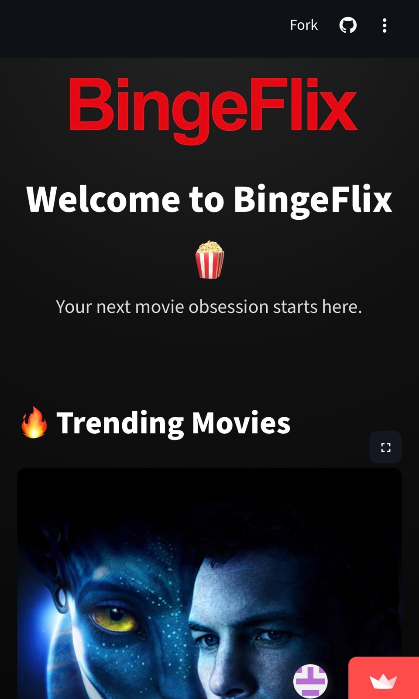
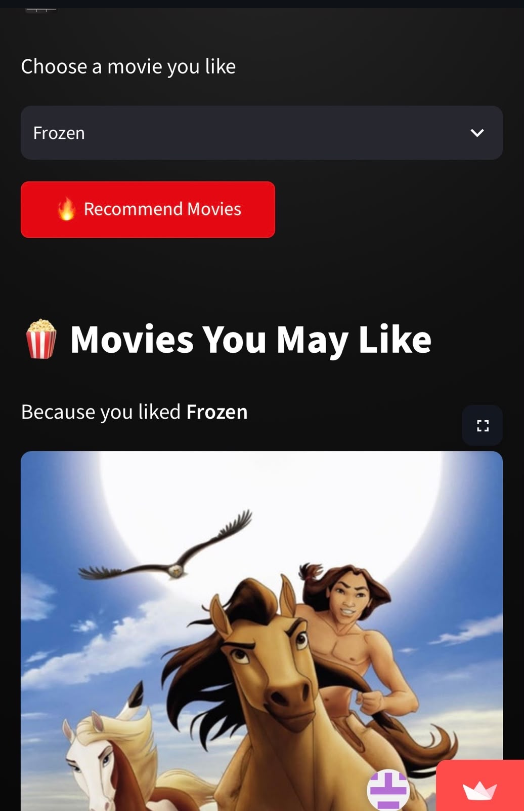

<div align="center">


</div>

<p>
BingeFlix is a content-based movie recommendation system built with
<strong>Python</strong> and <strong>Machine Learning</strong>.<br>
It recommends movies based on similarity between movie features such as
<strong>genres, keywords, cast, and crew</strong>.
</p>

</div>

---

## 🚀 Live Demo

<div align="center">

👉 **[Try BingeFlix](https://bingeflix-o9l5xomtjivh323wuyqcw4.streamlit.app/)**

</div>

---

## 🎬 Screenshots

### 🏠 BingeFlix Home

<div align="center">



</div>

---

### 🍿 Movie Recommendations

<div align="center">



</div>

---

## ✨ Features

- 🎬 Content-based movie recommendation
- 🤖 Machine Learning powered similarity
- 🍿 Simple and interactive Streamlit interface
- 🔎 Select a movie and get similar recommendations
- 🎭 Uses movie metadata such as genres, keywords, cast and crew
- ⚡ Fast recommendations using precomputed similarity
- 🎨 Netflix-inspired dark interface

---

## 🧠 How It Works

BingeFlix uses a **content-based recommendation approach**.

Movie information is combined from different features such as:

- Genres
- Keywords
- Cast
- Crew
- Movie overview

These features are transformed into a numerical representation and compared using **cosine similarity**.

When a user selects a movie, BingeFlix finds movies with the highest similarity scores and recommends them.

```text
Movie Dataset
      ↓
Feature Extraction
      ↓
Feature Combination
      ↓
Text Vectorization
      ↓
Cosine Similarity
      ↓
Similar Movies
      ↓
BingeFlix Recommendations 🍿
